# Swiggy Personal Dashboard

A personal, single-user, local-only dashboard built on Swiggy's official Builders Club MCP servers. One page, a sidebar, two tools:

- **Feaster** — type a dish, see nearby open restaurants that serve it, ranked by rating, filtered by veg/non-veg/all, with item photos, LLM-estimated nutrition, and an on-demand real coupon price per item. Zero-result searches get "try instead" suggestions instead of a dead end.
- **Insta-nt** — a chat that turns plain text ("add milk", "order things for making biryani") into real Instamart cart actions, with a web-grounded recipe flow and a per-item Q&A popup. Broad requests get a guided brand → size picker with photos and a quantity stepper; there's an editable "usuals" list with an optional daily auto-add, and you can even import a cart screenshot from another app to reorder it here.

Not a product, not multi-tenant — this is one person's own dashboard for their own Swiggy account, run on `localhost`. Not affiliated with or endorsed by Swiggy; built against their public Builders Club developer platform.

## Highlights

- **Measured a real bottleneck, then fixed it with data.** The chat agent started as a pure "the model decides everything" loop — it worked, but was measured at **7 Groq completions and ~129 seconds** for one guided add. Profiling showed most of what looked like "agent reasoning" was actually deterministic: searching, branching into a brand question or product cards, adding to cart. Rebuilt that flow **deterministic-first**, model only where real judgment is needed — down to **0–2 completions** per turn.
- **Caught an LLM fabricating a fact, and closed it with code, not a bigger prompt.** Adversarial-tested the per-item "Explain" feature with a deliberately fictional product. The search API's own synthesized summary invented a specific nutrition figure for it, sourced from an unrelated brand's page — and the model repeated it as fact, *even after* the prompt was explicitly told sources might describe other products. Prompting didn't hold, so the fix is a deterministic relevance filter: a source only counts if it verifiably mentions the product in question.
- **Every documented API behavior verified against the live server, not assumed.** Several didn't match: an "unscoped" search the docs describe as working returns nothing on the live beta; a coupon-fetch tool always returns `{}`; a cart-merge bug that silently doubled quantities under a specific race condition. Each is fixed and the discovery process recorded in `ARCHITECTURE.md` — not glossed over.
- **Diagnosed a "the cart won't stay cleared" report all the way to its real cause instead of patching the symptom.** A background poll made the cart panel look like it was actively undoing itself. Two rounds of provably-correct fixes (a stale-read race, then an unverified LLM cart-write path) didn't make the symptom go away — because the actual cause was Swiggy's own phone app writing to the same account cart concurrently, invisible to this app's logs. Confirmed with a temporary, opt-in audit trail rather than guessed at. The poll was removed once it was clear it was faithfully surfacing real shared state, not causing it — see `ARCHITECTURE.md` §6.17–6.18 for the full trail.

## Insta-nt in action

### Guided search

"add milk" is broad enough that Instamart returns half a dozen brands — so instead of guessing, Insta-nt asks. All of this is deterministic backend code, not a model decision (see Highlights above).

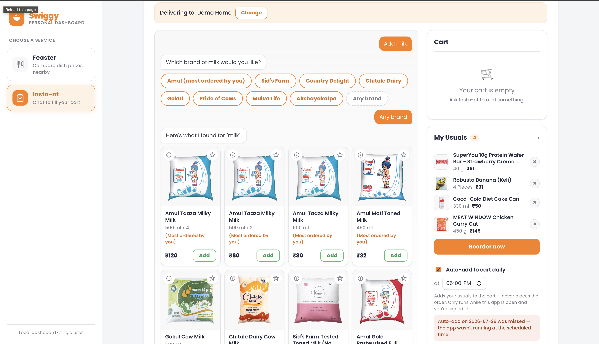
*"add milk" → a brand question (Amul flagged "most ordered by you" from real order history) → product cards, in one guided flow.*

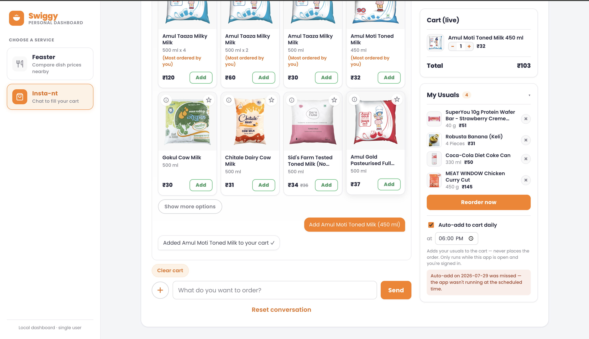
*The rest of the same grid, ending with "Added Amul Moti Toned Milk to your cart ✓" — a real, cart-verified confirmation that the item actually landed, not just a claim that the call didn't throw.*

### Per-item Explain — grounded Q&A, not a guess

An ℹ️ on any product card opens a scoped Q&A about that one item, backed by real web search rather than the model's memory.

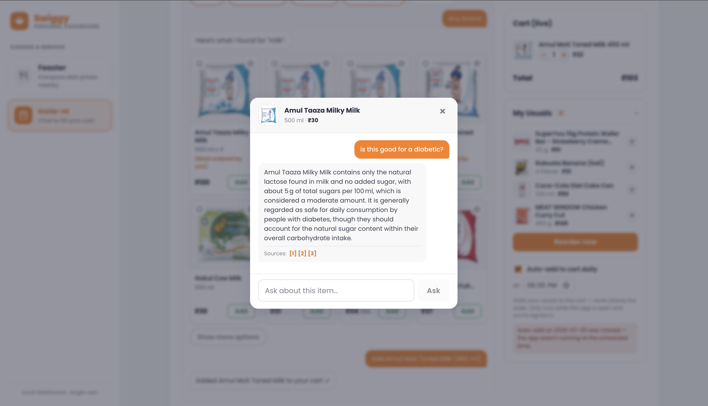
*"is this good for a diabetic?" on Amul Taaza Milk — a grounded answer with the actual sugar-content figure and `[1][2][3]` sources.*

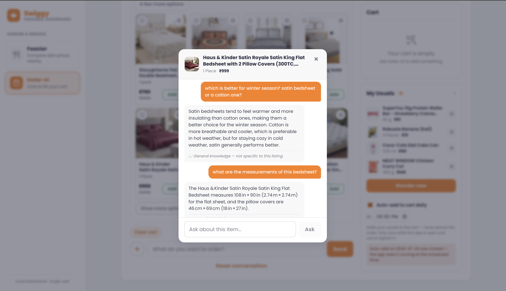
*Insta-nt sells more than groceries — same Explain popup, now on a bedsheet. Two different answer types in one thread: a comparison question ("satin vs cotton for winter") gets a **"💭 General knowledge — not specific to this listing"** answer, honestly labeled as recalled rather than sourced; the follow-up ("what are the measurements") gets a precise, product-specific answer instead. The distinction is deliberate — a cited fact and a recalled one are never shown the same way.*

### Recipe grounding

Broad, multi-item requests ("order things for making biryani") get grounded in a real recipe pulled from the web, not just whatever ingredients the model recalls.

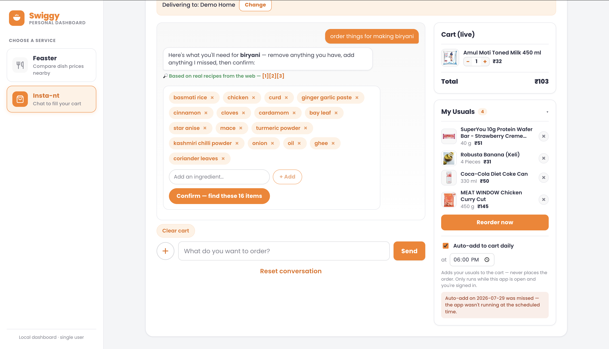
*"order things for making biryani" → a 16-ingredient checklist with a "🔎 Based on real recipes from the web — [1][2][3]" note.*

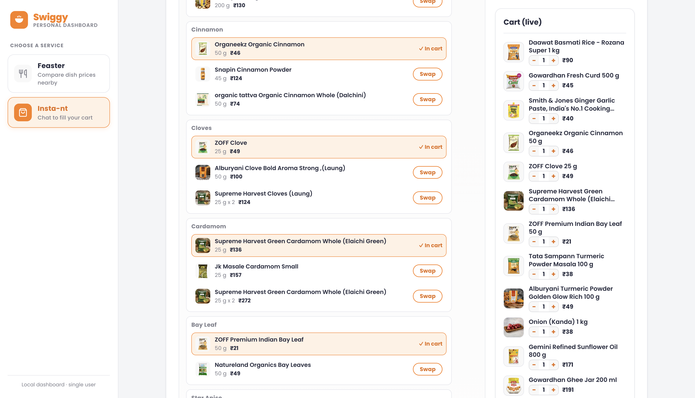
*After confirming: each ingredient is searched and auto-matched independently (Cinnamon, Cloves, Cardamom, Bay Leaf all shown "✓ In cart") — and each one explicitly shows its **2 runner-up alternatives with a Swap button**, so a wrong auto-pick is a one-click fix, not a re-order.*

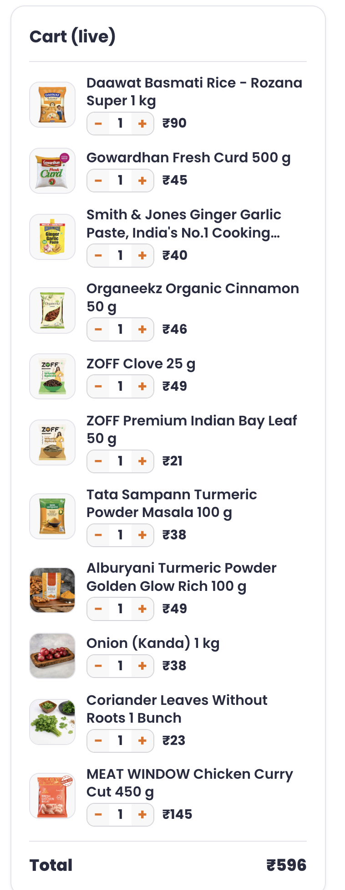
*The finished cart: all 12 biryani ingredients plus a chicken cut, ₹596 total — including a couple of items swapped away from the auto-pick, since a few of the first-choice matches weren't quite right and got corrected here.*

### Usuals + daily auto-add

A locally editable "usuals" list (☆ to save any product), separate from Swiggy's own read-only order history.

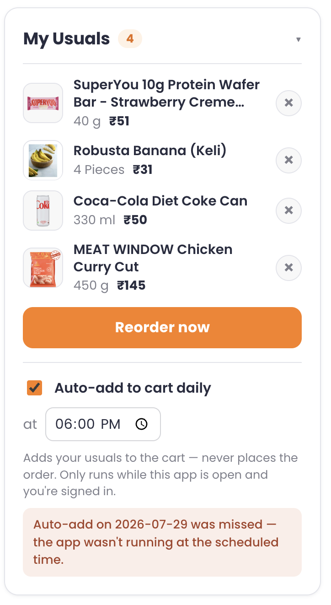
*4 saved usuals, "Reorder now," and a daily auto-add toggle — including an honest "Auto-add on 2026-07-29 was missed — the app wasn't running at the scheduled time" notice rather than silently pretending it ran.*

### Import from a screenshot

A cart from any other quick-commerce app can be uploaded as a screenshot and reproduced here — read once by a vision model, then handled by the exact same deterministic search/match pipeline as a typed order.

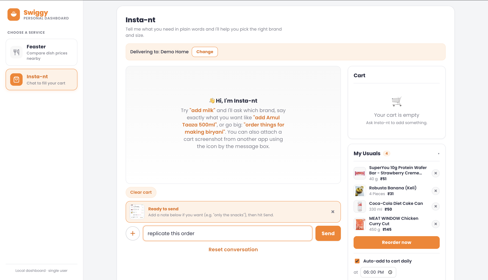
*The empty Insta-nt welcome state, with a cart screenshot from another app staged in the input ("replicate this order") — nothing uploads until Send is actually pressed.*

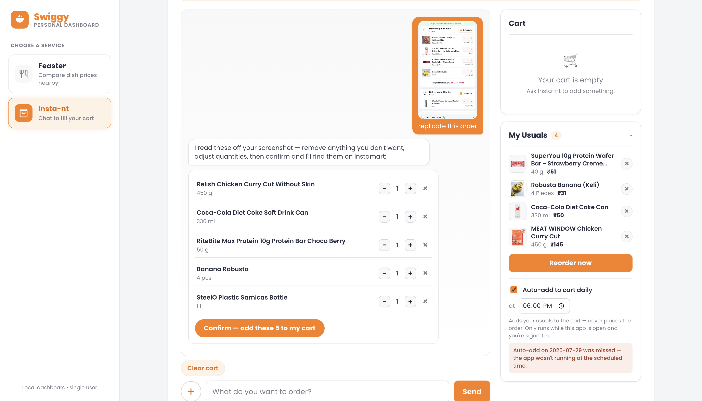
*5 items read off that screenshot into an editable checklist (quantity steppers, remove) — nothing touches the cart until this is confirmed.*

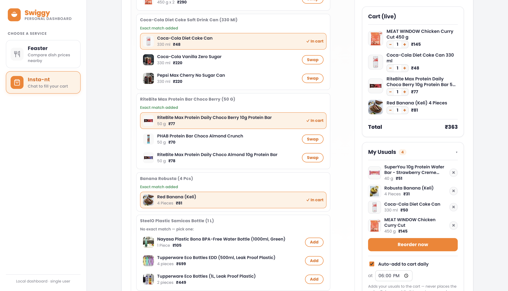
*After confirming: 4 of 5 items resolved to a genuine same-size, in-stock match and were auto-added ("✓ In cart"). The 5th (a steel bottle) had **no exact match in stock**, so instead of silently guessing or picking something wrong, it explicitly shows "No exact match — pick one" with 3 real alternatives to choose from.*

## Why this exists

Swiggy's MCP servers expose ordering as callable tools instead of a REST API, which makes them naturally agent-friendly — but a lot of documented behavior turned out not to match the live beta (an unscoped dish search that always returns empty, a coupon-fetch tool that returns `{}`, a veg filter with no non-veg-only mode, a response envelope that only sometimes wraps). Every gap like that is fixed and recorded here, not glossed over.

The Instamart chat agent also has its own story worth knowing before touching it: it started as a pure "the model decides everything" loop, which worked but was measured at **7 Groq completions and ~129 seconds for a single guided add**. Most of that flow — searching, branching into a brand question or product cards, adding to cart, reordering usuals — is now **deterministic backend code**, not the model deciding. See `ARCHITECTURE.md` for the full account.

## Setup

Requires Node 18+, a free [Groq API key](https://console.groq.com), and a Swiggy account.

```bash
git clone https://github.com/jgcarti123-cyber/Swiggy_agent.git
cd Swiggy_agent

cd backend
npm install
cp .env.example .env   # fill in GROQ_API_KEY at minimum
npm run dev             # http://localhost:8787

# in a second terminal
cd frontend
npm install
npm run dev             # http://localhost:5173
```

Open `http://localhost:5173`, click "Connect Swiggy account" (OAuth 2.1 + PKCE with phone + OTP — the same login as the Swiggy app), then use either panel. Access tokens last 5 days and don't refresh, so you'll be prompted to reconnect after that.

Optional: a free [Tavily API key](https://tavily.com) (`TAVILY_API_KEY` in `.env`) grounds the recipe flow and the per-item Explain popup in real web content. Both features work without it — they just fall back to the model's own knowledge, clearly marked as such.

## Stack

React + Vite frontend, Node/Express backend, SQLite for local state (OAuth token, saved address, editable usuals list, order history — never leaves the machine), Groq (`openai/gpt-oss-120b`) for the LLM pieces, Tavily (optional) for web-grounded answers, the official `@modelcontextprotocol/sdk` talking directly to `mcp.swiggy.com`. The backend binds to `127.0.0.1` only and is the only thing that ever holds the Swiggy token — the frontend never calls Swiggy directly.

## Docs

- **`CLAUDE.md`** — the quick-reference brief: which Swiggy tools are actually called, what's verified to *not* work as documented, and the current shape of both features. Read this before changing anything that touches a Swiggy tool call.
- **`ARCHITECTURE.md`** — the detailed record: every verified Swiggy quirk, every Groq rate-limit incident, and the full history of how Insta-nt went from a slow pure-LLM loop to a mostly-deterministic one, with measured before/after numbers.

## Scope

Single user, localhost only. No multi-tenant auth, no public deployment, no Telegram bot, no Dineout integration, no automated checkout without an explicit click.
